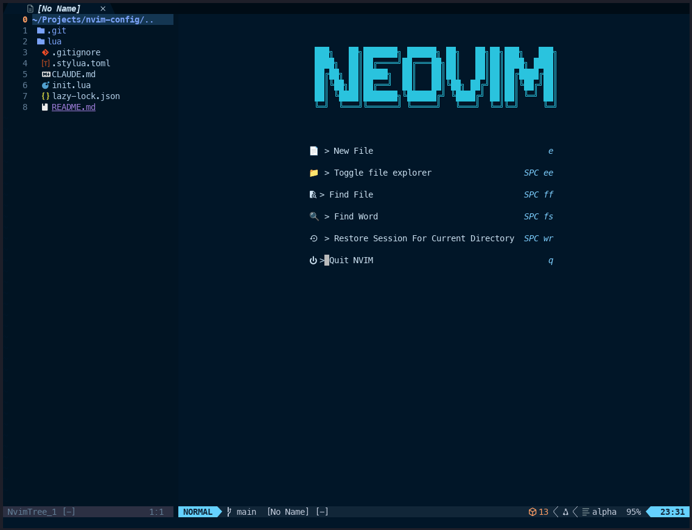

# Neovim Configuration

Modular Neovim configuration built on Lazy.nvim with focus on development productivity.

## Requirements

- Neovim >= 0.9.0
- Git
- [ripgrep](https://github.com/BurntSushi/ripgrep) for Telescope live grep
- [fd](https://github.com/sharkdp/fd) for better file finding performance
- C compiler for Treesitter parsers
- Node.js and npm for LSP servers and formatters
- Python 3 for Python development tools
- [lazygit](https://github.com/jesseduffield/lazygit) for git UI (optional)

## Installation

### Option 1: Direct Clone (Simple)

```bash
# Install Neovim (if not already installed)
# macOS
brew install neovim

# Ubuntu/Debian
sudo apt install neovim

# Arch Linux
sudo pacman -S neovim

# Backup existing configuration
mv ~/.config/nvim ~/.config/nvim.bak

# Clone repository
git clone https://github.com/mario-digital/nvim-config.git ~/.config/nvim

# Start Neovim - plugins will auto-install
nvim
```

### Option 2: Clone with Symlink (Recommended for Development)

Using a symlink allows you to keep the repository in your preferred location and easily pull updates from GitHub without affecting your Neovim config location.

```bash
# Install Neovim first (see commands above)

# Backup existing configuration
mv ~/.config/nvim ~/.config/nvim.bak

# Navigate to where you want to keep the repository
cd ~/your-preferred-directory  # Could be ~/Projects, ~/repos, ~/code, etc.

# Verify your location (this will show the full path)
pwd

# Clone the repository here
git clone https://github.com/mario-digital/nvim-config.git nvim-config

# Create symlink from ~/.config/nvim to the cloned repository
# Replace /path/to/your/nvim-config with the actual path from pwd above
ln -s $(pwd)/nvim-config ~/.config/nvim

# Verify the symlink was created correctly
ls -la ~/.config/nvim

# Start Neovim - plugins will auto-install
nvim
```

#### Example with actual paths:
```bash
# If you're in ~/Development
cd ~/Development
pwd  # Shows: /Users/yourname/Development
git clone https://github.com/mario-digital/nvim-config.git nvim-config
ln -s $(pwd)/nvim-config ~/.config/nvim
```

#### Benefits of Symlink Approach:
- Keep your config with your other projects
- Simple `git pull` to update from GitHub
- Easier to manage multiple configurations
- Can quickly switch configs by changing the symlink

#### For AI Assistant Users:
If you're using an AI assistant to set this up, provide this command:
> "I'm in [current directory from pwd]. Create a symlink from ~/.config/nvim to the nvim-config folder in my current directory after removing any existing ~/.config/nvim directory"

The assistant should run:
```bash
rm -rf ~/.config/nvim && ln -s $(pwd)/nvim-config ~/.config/nvim
```

## What You'll See

After installation, when you run `nvim`, you'll see the dashboard:



## Structure

```
~/.config/nvim/
├── init.lua                    # Entry point, loads core and lazy modules
├── lazy-lock.json              # Plugin version lock file
└── lua/
    └── mario/
        ├── lazy.lua            # Lazy.nvim bootstrap and configuration
        ├── core/
        │   ├── init.lua        # Core module loader
        │   ├── options.lua     # Vim options (tabs, search, clipboard)
        │   └── keymaps.lua     # Base keymaps (leader: space)
        └── plugins/
            ├── alpha.lua       # Start screen
            ├── auto-session.lua # Session management
            ├── autopairs.lua   # Bracket/quote pairing
            ├── bufferline.lua  # Buffer visualization
            ├── colorscheme.lua # Tokyo Night theme
            ├── comment.lua     # Code commenting
            ├── dressing.lua    # UI enhancements
            ├── formatting.lua # Code formatting (conform.nvim)
            ├── gitsigns.lua    # Git integration in buffers
            ├── indent-blankline.lua # Indentation guides
            ├── init.lua        # Common dependencies
            ├── lazygit.lua     # Git UI integration
            ├── linting.lua     # Asynchronous linting
            ├── lsp/
            │   ├── lspconfig.lua # LSP server configurations
            │   └── mason.lua   # LSP/tool installer
            ├── lualine.lua     # Status line
            ├── nvim-cmp.lua    # Completion engine
            ├── nvim-surround.lua # Surround text objects
            ├── nvim-tree.lua   # File explorer
            ├── substitute.lua  # Enhanced substitution
            ├── telescope.lua   # Fuzzy finder
            ├── todo-comments.lua # TODO highlighting
            ├── treesitter.lua  # Syntax highlighting
            ├── trouble.lua     # Diagnostics UI
            ├── vim-maximizer.lua # Window maximization
            └── which-key.lua   # Keymap hints
```

## Key Bindings

Leader key: `<Space>`

### Navigation
- `<leader>ff` - Find files
- `<leader>fs` - Live grep
- `<leader>fr` - Recent files
- `<leader>fc` - Search word under cursor
- `<leader>ft` - Find TODOs

### File Explorer
- `<leader>ee` - Toggle explorer
- `<leader>ef` - Focus current file
- `<leader>ec` - Collapse directories
- `<leader>er` - Refresh explorer

### Window Management
- `<leader>sv` - Split vertical
- `<leader>sh` - Split horizontal
- `<leader>se` - Equal splits
- `<leader>sx` - Close split
- `<leader>sm` - Maximize/restore

### Tabs/Buffers
- `<leader>to` - New tab
- `<leader>tx` - Close tab
- `<leader>tn` - Next tab
- `<leader>tp` - Previous tab

### Session
- `<leader>wr` - Restore session
- `<leader>ws` - Save session

### Editing
- `jk` - Exit insert mode
- `<leader>nh` - Clear search highlights
- `<leader>+` - Increment number
- `<leader>-` - Decrement number
- `gcc` - Comment line
- `gc` - Comment selection (visual mode)
- `gs` - Substitute with motion
- `gss` - Substitute line
- `gS` - Substitute to end of line
- Surround operations (nvim-surround):
  - `ys{motion}{char}` - Add surround
  - `ds{char}` - Delete surround
  - `cs{old}{new}` - Change surround

### Motion (Flash)
- `s` - Flash jump (search with labels)
- `S` - Flash treesitter (structural jump)
- `r` - Remote flash (operator mode)
- `R` - Treesitter search (operator/visual mode)
- `<C-s>` - Toggle flash search (command mode)

### LSP
- `gR` - Show LSP references
- `gD` - Go to declaration
- `gd` - Show LSP definitions
- `gi` - Show implementations
- `gt` - Show type definitions
- `<leader>ca` - Code actions
- `<leader>rn` - Smart rename
- `<leader>D` - Buffer diagnostics
- `<leader>d` - Line diagnostics
- `[d` - Previous diagnostic
- `]d` - Next diagnostic
- `K` - Hover documentation
- `<leader>rs` - Restart LSP

### Git
- `<leader>lg` - Open lazygit
- `]h` - Next git hunk
- `[h` - Previous git hunk
- `<leader>hs` - Stage hunk
- `<leader>hr` - Reset hunk
- `<leader>hS` - Stage buffer
- `<leader>hR` - Reset buffer
- `<leader>hu` - Undo stage hunk
- `<leader>hp` - Preview hunk
- `<leader>hb` - Blame line
- `<leader>hB` - Toggle line blame
- `<leader>hd` - Diff this
- `<leader>hD` - Diff this ~

### Diagnostics
- `<leader>xw` - Workspace diagnostics
- `<leader>xd` - Document diagnostics
- `<leader>xq` - Quickfix list
- `<leader>xl` - Location list
- `<leader>xt` - TODO list

### Formatting/Linting
- `<leader>mp` - Format file or range
- `<leader>l` - Trigger linting

### Tmux Navigation
- `<C-h>` - Navigate left
- `<C-j>` - Navigate down
- `<C-k>` - Navigate up
- `<C-l>` - Navigate right
- `<C-\>` - Navigate to previous

## Configuration Details

### Editor Settings
- Relative line numbers with absolute on cursor line
- 2-space indentation (expandtab)
- System clipboard integration
- Persistent undo
- No swap files
- Smart case search

### Plugin Details

**Core Dependencies**
- **plenary.nvim**: Lua utility functions used by multiple plugins (telescope, gitsigns, etc.) - loaded via init.lua
- **vim-tmux-navigator**: Seamless navigation between vim splits and tmux panes using consistent keybindings - loaded via init.lua

**Navigation & Search**
- **Telescope**: Extensible fuzzy finder with live grep, file browsing, and git integration. Configured with smart path display and fzf-native for performance.
- **nvim-tree**: File explorer with git status indicators, file operations, and configurable filters.

**Code Intelligence**
- **Treesitter**: Incremental parsing for accurate syntax highlighting and code understanding. Auto-installs parsers for common languages.
- **nvim-cmp**: Completion framework with sources for LSP, buffer text, file paths, and snippets. Includes LuaSnip for snippet expansion with friendly-snippets collection.
- **Mason**: Portable package manager for LSP servers, DAP servers, linters, and formatters. Auto-installs configured tools.
- **nvim-lspconfig**: Quickstart configurations for Neovim's built-in LSP client. Pre-configured for TypeScript, Python, Lua, HTML, CSS, and more.

**Editing Enhancements**
- **nvim-surround**: Add, delete, and change surrounding pairs (quotes, brackets, tags) with intuitive motions.
- **substitute.nvim**: Enhanced substitution operations with motion support and visual mode integration.
- **comment.nvim**: Smart commenting with language-aware comment strings.
- **autopairs**: Automatic insertion of closing brackets, quotes, and other pairs.
- **todo-comments**: Highlight and search TODO, FIXME, NOTE comments with custom styling.
- **flash.nvim**: Navigate with search labels, jump to any location with minimal keystrokes.

**Git Integration**
- **gitsigns.nvim**: Git decorations in the sign column, inline blame, hunk actions, and diff preview.
- **lazygit.nvim**: Terminal UI for git operations, accessible within Neovim.

**Code Quality**
- **conform.nvim**: Lightweight, asynchronous formatter. Configured for Prettier (JS/TS/HTML/CSS), Black (Python), and Stylua (Lua).
- **nvim-lint**: Asynchronous linting framework. Runs ESLint for JavaScript/TypeScript and Pylint for Python on save.
- **trouble.nvim**: Pretty list for diagnostics, references, quickfix, and location lists with workspace-wide diagnostic aggregation.

**UI Enhancements**
- **Tokyo Night**: Dark color scheme with modified backgrounds for terminal contrast.
- **lualine**: Fast statusline with git branch, diagnostics, and file info.
- **bufferline**: Buffer tabs with diagnostics integration and close buttons.
- **alpha-nvim**: Customizable start screen with recent files and project shortcuts.
- **which-key**: Displays available keybindings in popup as you type.
- **dressing.nvim**: Improved UI for vim.ui.select and vim.ui.input.
- **indent-blankline**: Visual indentation guides with scope highlighting.

**Session Management**
- **auto-session**: Workspace persistence. Automatically saves and restores session state, excludes ~/Downloads and ~/Desktop.

## Language Server Configuration

Mason automatically installs and manages LSP servers, formatters, and linters. The following are pre-configured:

### LSP Servers
- **tsserver**: TypeScript/JavaScript
- **html**: HTML
- **cssls**: CSS/SCSS/Less
- **tailwindcss**: Tailwind CSS
- **svelte**: Svelte
- **lua_ls**: Lua
- **graphql**: GraphQL
- **emmet_ls**: Emmet abbreviations
- **prismals**: Prisma
- **pyright**: Python

### Formatters
- **prettier**: JavaScript, TypeScript, HTML, CSS, JSON, Markdown
- **stylua**: Lua
- **black**: Python
- **isort**: Python imports

### Linters
- **eslint_d**: JavaScript/TypeScript
- **pylint**: Python

Mason will automatically install these tools on first launch. To install additional tools:

```vim
:Mason                  " Open Mason UI
:MasonInstall <tool>    " Install specific tool
:MasonUninstall <tool>  " Remove tool
:MasonUpdate            " Update all tools
```

To add more language servers, edit `lua/mario/plugins/lsp/mason.lua` and add to the `ensure_installed` lists.

## Plugin Management

```vim
:Lazy               " Open plugin manager
:Lazy update        " Update plugins
:Lazy sync          " Sync plugin state
:Lazy restore       " Restore from lock file
```

## Troubleshooting

### Health Check
```vim
:checkhealth
```

### Common Issues

**Telescope errors**: Install ripgrep and fd:
```bash
# macOS
brew install ripgrep fd

# Linux
sudo apt install ripgrep fd-find
```

**Treesitter compilation fails**: Ensure C compiler is installed:
```bash
# macOS
xcode-select --install

# Linux
sudo apt install build-essential
```

**Fonts**: For proper icon display, install a Nerd Font:
```bash
brew tap homebrew/cask-fonts
brew install --cask font-hack-nerd-font
```

## Performance

- Lazy loading configured for most plugins
- Treesitter uses incremental parsing
- Telescope uses fzf-native for C-speed sorting
- Auto-session excludes large directories
- Startup time: ~50-100ms on modern hardware

## License

MIT